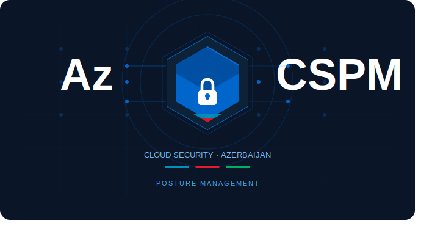

<!--
  AzCSPM — Azərbaycan Cloud Security Posture Management
  Prowler nüvəsi üzərində qurulmuş, lokallaşdırılmış CSPM platforması.
-->

<p align="center">
  
</p>

<h1 align="center">AzCSPM</h1>
<p align="center"><em>Azərbaycan üçün açıq mənbəli Bulud Təhlükəsizlik Postur İdarəetmə (CSPM) platforması.</em></p>

<p align="center">
  <a href="#"></a>
  <a href="LICENSE"></a>
  <a href="#"></a>
  <a href="#azərbaycan-uyğunluq-çərçivələri"></a>
  <a href="#"></a>
  <a href="#"></a>
</p>

---

## 📑 İçindəkilər

1. [AzCSPM nədir?](#-azcspm-nədir)
2. [Azərbaycan Bazarı üçün Fərqli nə var?](#-azərbaycan-bazarı-üçün-fərqli-nə-var)
3. [Dəstəklənən platformalar](#-dəstəklənən-platformalar)
4. [Azərbaycan uyğunluq çərçivələri](#-azərbaycan-uyğunluq-çərçivələri)
5. [Quraşdırma](#-quraşdırma)
6. [Tez başlanğıc (Quickstart)](#-tez-başlanğıc-quickstart)
7. [AI-əsaslı analiz (SARGE)](#-ai-əsaslı-analiz-sarge)
8. [Konfiqurasiya](#-konfiqurasiya)
9. [Töhfə vermək (Contributing)](#-töhfə-vermək-contributing)
10. [Lisenziya](#-lisenziya)
11. [Əlaqə və dəstək](#-əlaqə-və-dəstək)

---

## 🇦🇿 AzCSPM nədir?

**AzCSPM** — açıq mənbəli [Prowler](https://github.com/prowler-cloud/prowler) nüvəsi üzərində qurulmuş, **Azərbaycan tənzimləyici mühitinə** lokallaşdırılmış Bulud Təhlükəsizlik Postur İdarəetmə platformasıdır. AWS, Azure, GCP ilə yanaşı **AzInCloud (Gcore-əsaslı suveren bulud)** və **G-Cloud (Azərbaycan Hökumət Buludu)** provayderlərini birbaşa dəstəkləyir. Mərkəzi Bank, FinCERT, Milli Kibertəhlükəsizlik Strategiyası və Şəxsi Məlumatlar Qanunu daxil olmaqla Azərbaycan tənzimləyici çərçivələri üçün hazır audit şablonları, AI-əsaslı düzəliş tövsiyələri və Azərbaycan dilində tam interfeys təklif edir.

---

## 🚀 Azərbaycan Bazarı üçün Fərqli nə var?

| Üstünlük | Niyə vacibdir? |
|---|---|
| 🇦🇿 **AzInCloud (Gcore) suveren bulud dəstəyi** | Mövcud heç bir açıq mənbəli CSPM alətində yoxdur — ilk və yeganə |
| 🏦 **AMB Kibertəhlükəsizlik Strategiyası 2023-26** üçün hazır audit şablonu | Bank və ödəniş sistemləri üçün avtomatik uyğunluq sübutu |
| 📊 **FinCERT hesabatlılıq formatında avtomatik ixrac** | Tənzimləyiciyə təqdim olunan hesabatlar bir kliklə hazır |
| 🌐 **Azərbaycan dilində tam interfeys və hesabatlar** | Daxili audit komandası ingiliscə bilməsə də işləyə bilir |
| 🤖 **AI filtri ilə yalançı müsbətlərin azaldılması** | KOB-lar üçün kritik — kiçik təhlükəsizlik komandasını boğmur |

---

## ☁️ Dəstəklənən platformalar

| Provayder | Status | Qeyd |
|---|---|---|
| **AWS** | ✅ Tam dəstək | Prowler-dən miras (500+ check) |
| **Azure** | ✅ Tam dəstək | Prowler-dən miras |
| **Google Cloud (GCP)** | ✅ Tam dəstək | Prowler-dən miras |
| **AzInCloud (Gcore)** | ✅ Tam dəstək | **AzCSPM-ə xas** — Storage, Compute, Network, IAM |
| **G-Cloud (Azərbaycan)** | ✅ Tam dəstək | Tier III sertifikatlaşdırma + Data residency yoxlamaları |
| **Kubernetes** | ✅ Tam dəstək | Prowler-dən miras |
| **Microsoft 365** | ✅ Tam dəstək | Prowler-dən miras |

---

## 📜 Azərbaycan uyğunluq çərçivələri

| Çərçivə | Tənzimləyici | Status |
|---|---|---|
| **AMB İT İdarəetmə Qaydaları 2022** | Azərbaycan Mərkəzi Bankı | ✅ Dəstəklənir |
| **FinCERT Hesabatlılıq** | AMB / FinCERT | ✅ Dəstəklənir |
| **Milli Kibertəhlükəsizlik Strategiyası 2023-27** | Dövlət Təhlükəsizlik Xidməti | ✅ Dəstəklənir |
| **G-Cloud Fərman №718** | Rəqəmsal İnkişaf və Nəqliyyat Nazirliyi | ✅ Dəstəklənir |
| **Şəxsi Məlumatlar Qanunu №998-IIIQ** | Ədliyyə Nazirliyi | ✅ Dəstəklənir |
| **ISO/IEC 27001:2022** | Beynəlxalq standart | ✅ Dəstəklənir |
| **PCI DSS v4.0** | PCI SSC | ✅ Dəstəklənir |
| **CIS Benchmarks** (AWS / Azure / GCP) | Center for Internet Security | ✅ Prowler-dən miras |
| **CIS Critical Security Controls v8** | Center for Internet Security | ✅ Dəstəklənir |
| **GDPR** | Avropa Birliyi | ✅ Dəstəklənir |
| **Azerbaijan Data Sovereignty Framework** | AzCSPM lokal çərçivə | ✅ Dəstəklənir |

---

## 📦 Quraşdırma

### pip ilə (Python 3.10+)

```bash
pip install azcspm
```

### Docker

```bash
docker run -it --rm \
  -v $(pwd)/output:/output \
  ghcr.io/azcspm/azcspm:latest \
  scan --provider aws
```

### Homebrew (macOS)

```bash
brew tap azcspm/tools
brew install azcspm
```

### docker-compose ilə tam stack (UI + API + Worker)

```bash
git clone https://github.com/azcspm/azcspm.git
cd azcspm
cp .env.example .env
docker compose up -d
# UI: http://localhost:3000
# API docs: http://localhost:9080/api/v1/docs
```

---

## ⚡ Tez başlanğıc (Quickstart)

### 🇦🇿 AzInCloud (Gcore suveren bulud) üçün — 5 addım

```bash
# 1. Provayderin konfiqurasiyası
azcspm configure --provider azincloud --region baku-1

# 2. API açarını daxil et (interaktiv) və ya environment-də
export AZINCLOUD_API_KEY="<sənin Gcore API açarın>"

# 3. AMB 2022 uyğunluq çərçivəsi ilə yoxlama
azcspm scan --compliance cbar_2022

# 4. Hesabatı Azərbaycan dilində HTML formatında ixrac et
azcspm report --format az_html --lang az --output ./reports/

# 5. FinCERT hesabatlılıq formatında JSON ixracı
azcspm report --format fincert_json --output ./reports/fincert.json
```

### 🏛️ G-Cloud (Azərbaycan Hökumət Buludu) üçün — 5 addım

```bash
# 1. G-Cloud kimliyi konfiqurasiya et
azcspm configure --provider gcloud --tenant az-gov-001

# 2. Servis hesabı açarını yüklə
azcspm auth gcloud --service-account-key ./gcloud-sa.json

# 3. Tier III + Data Residency uyğunluq yoxlaması
azcspm scan --compliance gcloud_tier3,az_data_residency

# 4. Nəticələri panel-də canlı izlə
azcspm dashboard --port 3000

# 5. PDF hesabat (rəsmi imkan-imza ilə)
azcspm report --format pdf --signed --lang az
```

### ☁️ AWS / Azure / GCP üçün — standart axın

```bash
# AWS (default credentials chain)
azcspm scan --provider aws --compliance cis_v8,iso27001_2022

# Azure (az CLI sessiyası ilə)
az login
azcspm scan --provider azure --compliance cis_v8,iso27001_2022

# GCP (Application Default Credentials)
gcloud auth application-default login
azcspm scan --provider gcp --compliance cis_v8,iso27001_2022

# Bütün hesabatlar bir əmrlə
azcspm scan --provider aws --output-formats csv,json-ocsf,html,pdf
```

---

## 🤖 AI-əsaslı analiz (SARGE)

**SARGE** (*Security-Aware Reasoning & Generative Enforcement*) — AzCSPM-in LLM-əsaslı analiz qatıdır:

- **🧠 LLM inteqrasiyası** — Gemini 1.5 Pro və Claude 3.5 Sonnet vasitəsilə Terraform, CloudFormation və Kubernetes manifest-lərinin **semantik təhlili**. Qayda mühərrikinin görmədiyi niyyət-səviyyəli pozuntuları aşkarlayır.
- **📚 RAG düzəliş mühərriki** — yerli **Azərbaycan tənzimləyici bilik bazası** (AMB, FinCERT, ISO 27001, Şəxsi Məlumatlar Qanunu) üzərində Retrieval-Augmented Generation. Hər tövsiyə mənbə sənədlə əsaslandırılır.
- **⚖️ AI prioritetləşdirmə** — CVSS + EPSS + biznes-kontekst (PII, internet eksponensiyası) əsasında tapıntıları yüksək / orta / aşağı kateqoriyalarına bölür.
- **🔇 Səs-küy filtri** — vəziyyət-tag bazlı mute-list-lər və statistik reqressiya ilə yalançı müsbət uyarıları azaldır. KOB-lar üçün kritik fəaliyyətdir.

**Məxfilik:** RAG bilik bazası **lokal FAISS indeksi** kimi işləyir. Müştərinin tapıntı metadata-sı tenancy-dən kənara çıxmır.

```bash
# IaC repo-sunu SARGE ilə skan et
azcspm sarge analyze --repo ./terraform/
azcspm sarge remediate --finding-id <id> --grounded-on amb_2022
```

Detallı sənədləşmə: [`docs/ai/sarge.md`](docs/ai/sarge.md)

---

## ⚙️ Konfiqurasiya

### `azcspm.yaml` nümunəsi

```yaml
# Layihə kökündə yerləşdir: ./azcspm.yaml
version: 1

provider:
  name: azincloud           # azincloud | gcloud | aws | azure | gcp | kubernetes | m365
  region: baku-1
  credentials_env: AZINCLOUD_API_KEY

compliance:
  frameworks:
    - cbar_2022
    - fincert_reporting
    - az_data_sovereignty
    - cis_controls_v8
    - iso27001_2022

output:
  formats: [csv, html, ocsf, fincert_json]
  language: az
  output_dir: ./reports
  signed_pdf:
    enabled: true
    cert_path: ~/.azcspm/signing.p12

ai:
  sarge:
    enabled: true
    backend: gemini-1.5-pro     # gemini-1.5-pro | claude-3-5-sonnet | gpt-4o
    confidence_threshold: 0.65
  rag:
    knowledge_base: ./data/knowledge_base/az_regulations
    top_k: 5
  noise_filter:
    enabled: true
    muted_tags:
      environment: [sandbox, scratch, ephemeral]

scheduler:
  enabled: true
  cron: "0 2 * * *"            # hər gün gecə saat 02:00
```

### Compliance framework seçimi

```bash
# Mövcud çərçivələrin siyahısı
azcspm compliance list

# Bir neçə çərçivəni eyni vaxtda işlət
azcspm scan --compliance cbar_2022,iso27001_2022,az_data_sovereignty

# Yalnız uğursuz tələbləri göstər
azcspm compliance status --framework cbar_2022 --only-failed
```

---

## 🤝 Töhfə vermək (Contributing)

AzCSPM açıq mənbəlidir və icma töhfələrini **hərarətlə qarşılayır** — xüsusilə Azərbaycan-spesifik check-lər, tənzimləyici sənədləşmə və Azərbaycan dili tərcümələri.

### Yeni Azərbaycan check-i əlavə etmə yolu

1. **Repo-nu fork edin** və yeni bir `feature/<check-name>` branch yaradın.
2. **Check faylı** yaradın: `checks/<az_*>/<check_name>.py` — mövcud check-ləri (məs. `checks/az_cbar/cbar_encryption_at_rest.py`) şablon olaraq götürün.
3. **Metadata** əlavə edin: `metadata.json` faylında severity, mənbə tənzimləyici, remediation addımları olmalıdır.
4. **Bilik bazasına** istinad: əgər yeni bir tənzimləyici sənədə əsaslanır, `data/knowledge_base/az_regulations/` qovluğuna markdown əlavə edin.
5. **Test yazın**: `tests/checks/az_*/` altında — minimum 1 pass + 1 fail nümunəsi.
6. **Pull request** açın — şablonu doldurun, tənzimləyici sənədə link verin.

Detallar: [`CONTRIBUTING.md`](CONTRIBUTING.md) və [`docs/contributing/azerbaijani-checks.md`](docs/contributing/azerbaijani-checks.md).

---

## 📄 Lisenziya

AzCSPM **Apache 2.0** lisenziyası altında paylaşılır — Prowler-in əsl lisenziyası ilə uyğundur.

```
Copyright 2024-2026 Azintelecom MMC və AzCSPM töhfəçiləri
Licensed under the Apache License, Version 2.0
```

Tam mətn: [`LICENSE`](LICENSE)

---

## 📞 Əlaqə və dəstək

| Kanal | Ünvan |
|---|---|
| 📧 **E-poçt (yerli dəstək)** | support@azcspm.az |
| 💬 **Telegram kanal** | [@azcspm_az](https://t.me/azcspm_az) |
| 🐛 **Xəta bildirişi** | [GitHub Issues](https://github.com/azcspm/azcspm/issues) |
| 💼 **Korporativ inteqrasiya** | enterprise@azcspm.az |
| 📚 **Sənədləşmə** | [docs.azcspm.az](https://docs.azcspm.az) |
| 🛡️ **Təhlükəsizlik (CVE bildirişi)** | security@azcspm.az (PGP açar saytda) |

---

<p align="center">
  <sub>AzCSPM — açıq mənbəli Prowler nüvəsi üzərində qurulmuşdur · Azərbaycanda hazırlanır 🇦🇿</sub>
</p>
